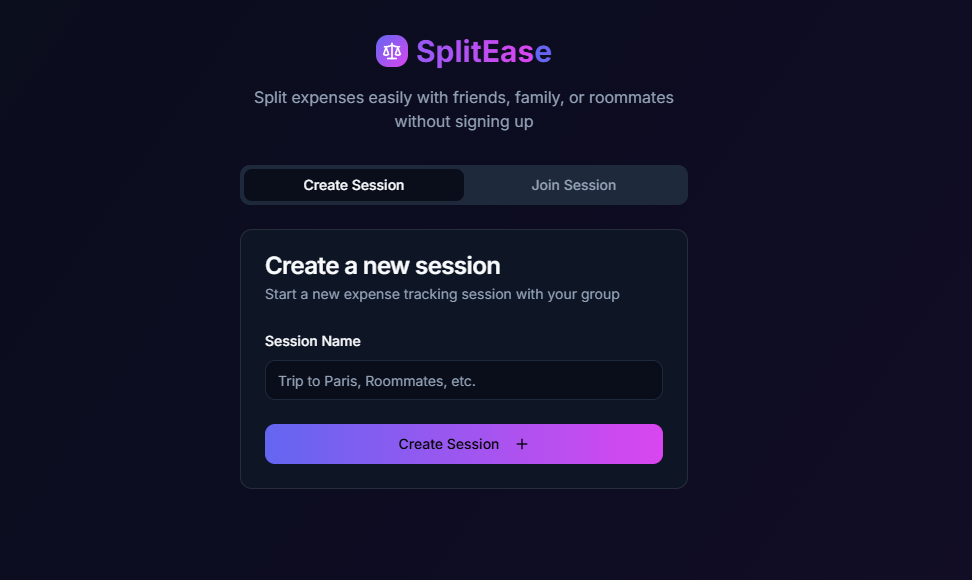

<div align="center">
  <a href="https://splitease.netlify.app/" target="_blank">
    
  </a>
  <h1 align="center">Splitease</h1>
  <p align="center">
    Split bills, not friendships. A modern, intuitive bill-splitting application that makes shared expenses effortless.
    <br />
    <a href="https://splitease.netlify.app/"><strong>splitease.netlify.app »</strong></a>
    <br />
    <br />
    <a href="https://github.com/hariharen9/splitease/issues/new?template=bug_report.md">Report Bug</a>
    ·
    <a href="https://github.com/hariharen9/splitease/issues/new?template=feature_request.md">Request Feature</a>
  </p>
</div>

<div align="center">

[](https://opensource.org/licenses/MIT)
[](https://www.typescriptlang.org/)
[](https://react.dev/)
[](https://web.dev/progressive-web-apps/)
[](https://firebase.google.com/docs/firestore)

</div>

---

## 🌟 About Splitease

**Splitease** is a modern, feature-rich, web-based bill-splitting application designed to eliminate the hassle of shared expenses. While many bill-splitting apps are either too simple or require cumbersome account creation, Splitease offers a powerful suite of features in a free, no-signup-required package.

Whether you're traveling with friends, sharing an apartment, or organizing a group dinner, Splitease provides an intuitive and effortless way to track and settle expenses with real-time synchronization.

<div align="center">
  
</div>

---

## ✨ Features

Splitease is packed with features that provide a comprehensive and seamless expense management experience:

#### Core Functionality
- **🧮 Smart Expense Splitting:** Split expenses by equal, percentage, or exact custom amounts.
- **📊 Intelligent Settlements:** Get optimized payment suggestions to settle debts with the minimum number of transactions.
- **👥 Unlimited Members:** Add as many members to a session as you need.
- **📂 Multi-Session Management:** Create and switch between multiple expense sessions.

#### Modern & User-Friendly
- **🌐 No Account Required:** Jump right in without the need for registration.
- **🎨 Modern UI/UX:** A beautiful and intuitive interface built with **shadcn-ui** and **Tailwind CSS**.
- **⚡ Lightning Fast:** Built with **Vite** for a snappy and seamless user experience.
- **📱 PWA Ready:** Install Splitease on your home screen for an app-like experience, including offline access.

#### Advanced Features
- **🔄 Real-time Syncing:** All session data syncs instantly across all devices with an optional Firebase backend.
- **🔗 Effortless Sharing:** Share sessions easily with a **PIN**, a direct **Magic Link**, or a scannable **QR Code**.
- **📈 Spending Analytics:** Visualize spending habits with charts for expenses by category and member.
- **📝 Activity Log:** Keep track of all actions taken within a session with a filterable history.

---

## 🤔 Why Splitease?

In a world of subscription fees and data-hungry apps, Splitease stands out by offering a unique combination of power and simplicity, completely for free.

| Feature                  | Splitease | Most Alternatives |
| ------------------------ | :-------: | :---------------: |
| **No Account Required**  |    ✅     |        ❌         |
| **Free to Use**          |    ✅     |   Often limited   |
| **Real-time Sync**       |    ✅     |        ❌         |
| **Advanced Splitting**   |    ✅     |   Often basic     |
| **Link & QR Code Sharing** |    ✅     |        ❌         |
| **Spending Analytics**   |    ✅     |        ❌         |

---

## 💻 Technologies

Splitease is built with a modern and powerful tech stack:

- **Frontend Framework:** [React 18](https://react.dev/) with [TypeScript](https://www.typescriptlang.org/)
- **Styling:** [Tailwind CSS](https://tailwindcss.com/) with [shadcn-ui](https://ui.shadcn.com/) components
- **Build Tool:** [Vite](https://vitejs.dev/)
- **State Management:** [Zustand](https://zustand-demo.pmnd.rs/)
- **Database (Optional):** [Firebase Firestore](https://firebase.google.com/docs/firestore)
- **PWA Support:** Service workers for offline functionality

---

## 🚀 Getting Started

To get a local copy up and running, follow these simple steps.

### Prerequisites

Make sure you have [Node.js](https://nodejs.org/) and [npm](https://www.npmjs.com/) installed on your machine.

### Installation

1.  **Clone the repository:**
    ```sh
    git clone https://github.com/hariharen9/splitease.git
    ```
2.  **Navigate to the project directory:**
    ```sh
    cd splitease
    ```
3.  **Install dependencies:**
    ```sh
    npm install
    ```
4.  **Start the development server:**
    ```sh
    npm run dev
    ```

The application will be available at `http://localhost:8080`.

---

## 📖 Usage

1.  **Create a Session:** Start a new expense session and give it a name.
2.  **Share the PIN:** Share the generated PIN with your friends to let them join.
3.  **Add Members:** Add everyone who's part of the expense group.
4.  **Track Expenses:** Record expenses as they happen, specifying who paid and how the bill should be split.
5.  **Settle Up:** Use the suggested settlements to easily square up with everyone in the group.

---

## 🤝 Contributing

Contributions are what make the open-source community such an amazing place to learn, inspire, and create. Any contributions you make are **greatly appreciated**.

If you have a suggestion that would make this better, please fork the repo and create a pull request. You can also simply open an issue with the tag "enhancement".

1.  **Fork the Project**
2.  **Create your Feature Branch** (`git checkout -b feature/AmazingFeature`)
3.  **Commit your Changes** (`git commit -m '''Add some AmazingFeature'''`)
4.  **Push to the Branch** (`git push origin feature/AmazingFeature`)
5.  **Open a Pull Request**

---

## 📝 License

Distributed under the MIT License. See `LICENSE` for more information.

---

## 👨‍💻 Author

Developed with ❤️ by **Hariharen**

-   LinkedIn: [linkedin.com/in/hariharen9](https://www.linkedin.com/in/hariharen9/)
-   GitHub: [github.com/hariharen9](https://github.com/hariharen9)

---

<div align="center">
  <p><strong>Splitease - Split bills, not friendships.</strong></p>
</div>
